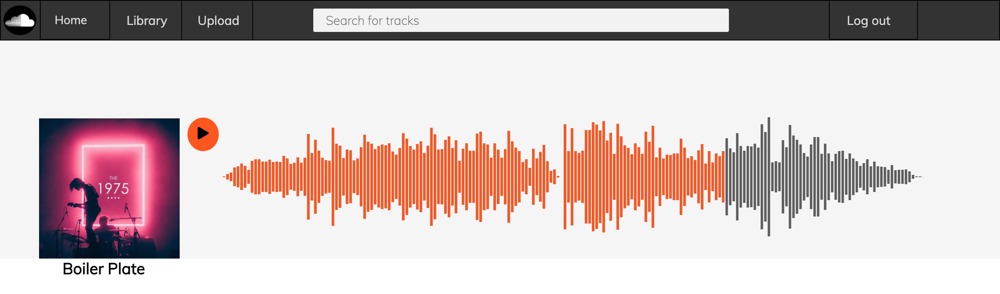

SONAR
=====
[Sonar](https://appsonar.herokuapp.com/#/) is a web page, clone of SoundCloud built with Ruby on Rails, ReactJS, and Redux. On Sonar, artists are able to upload their tracks for the world to stream, share, and like. 


## Technologies

Sonar was built using Rails for the backend, React/Redux for the frontend. Database was managed by PostgreSQL and Wavesurfer.js library which is built on top the Web Audio API and HTML5 Canvas to build the web audio waves.

## Features

### Track Show & Waveform
<!-- waveform.jsx -->

* After setting up the `waveform` using the wavesurfer library, with this code down below, audio can be played and stopped.

```javascript
handlePlay = () => {
        this.setState({ playing: !this.state.playing });
        this.waveform.playPause();
    };
```


* With this code below, A specific track will be rendered as `tracks/:trackId` with an audio file, an image and a wave that is created above.
<!-- track_show.jsx  -->

```javascript
 render(){
        const {track, currentUser, artistId} = this.props;
        
        if ((track === undefined)){
            return null
        }else if(currentUser){
            return (
                <> 
                    
                        <Waveform track={track}/>
                    <span id="track-show-title">{track.title}</span>
                </>
            )
        }
    }
```
### Search
<!-- search.jsx -->

* Search functionality works as the user clicks on the bar and the `currList` is set to all of the tracks. To filter the tracks `newList` is filtered and used to update the state on line 72.

```javascript

handleChange(e) {
        let currList = [];
        let newList = [];

        if (e.target.value !== "") {
            currList = this.props.tracks;
            newList = currList.filter((track) => {
                let lowerCaseTrack;
                // ensure of an object
                typeof track == "object"
                // lower case mandatory
                    ? (lowerCaseTrack = track.title.toLowerCase())
                    : (lowerCaseTrack = track.toLowerCase());
                let filter = e.target.value.toLowerCase();

                return lowerCaseTrack.includes(filter);
            });
        } else {
            newList = this.props.tracks;
        }
        this.setState({
            filtered: newList,
        });
    }
```


## Future Implementations

* Track Upload (COMPLETED)
* Slider on the home page
